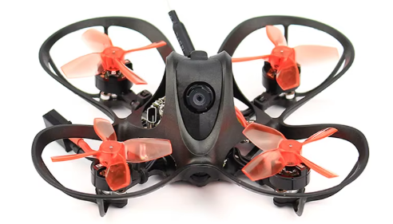

# nanohawk-agent


**AI-powered autonomous control agent for the EMAX Nanohawk 1S FPV Drone.**

A modular C++20 desktop application that uses a local LLM to interpret natural-language commands and fly the Nanohawk via the Betaflight MSP serial protocol. No FPV goggles required. Live camera feed streams to your desktop. You type a prompt; the agent executes it on the drone.

EMAX Nanohawk 1S -- https://emax-usa.com/products/nanohawk-1s-ultralight-brushless-fpv-drone

---

## Hardware

| Component | Spec |
|---|---|
| Frame | 65 mm brushless micro FPV |
| Flight Controller | STM32 running **Betaflight 4.2.0** |
| USB Identity | VID `0483` / PID `5740` (STM32 USB CDC) |
| Serial Protocol | **MSP V1** at 115200 baud |
| Motors | 0802 brushless, 4-in-1 ESC |
| FPV Camera | Analog + 5.8 GHz VTX (desktop capture via USB dongle) |
| Connection | USB-C to laptop (COM3) -- confirmed working |

---

## System Architecture

```
+---------------------------------------------------------+
|              Desktop AI Control Station                  |
|                                                          |
|  nanohawk-agent.exe  (Qt6 GUI)                          |
|  +- VideoPane     -- live FPV feed (no goggles needed)  |
|  +- PromptPane    -- natural-language command input      |
|  +- TelemetryPane -- battery, attitude, RC channels      |
|  +- MissionPane   -- mission JSON preview + execute      |
|  +- SafetyPane    -- geofence, battery limits, auth      |
|                                                          |
|  nanohawk_agent_cli.exe  (headless runner / CI)         |
|  launcher.exe  (Windows tray, auto-launches on detect)  |
|                                                          |
|  AI Core                                                 |
|  +- LlmClient       -> llama.cpp HTTP (local, default)   |
|  +- PromptCompiler  -> system prompt + mission schema    |
|  +- JsonPlanParser  -> strict mission JSON validation    |
|  +- MissionPlanner  -> Prompt -> TaskGraph               |
|  +- MissionExecutor -> TaskGraph -> MSP commands         |
|  +- SafetyEngine    -> altitude, battery, geofence veto  |
|                                                          |
|  MSP Layer (Betaflight serial protocol)                  |
|  +- MspClient       -> MSP V1 framing over USB serial    |
|  +- DeviceWatcher   -> auto-detect drone (WiFi + USB)    |
|  +- HeartbeatMonitor-> link loss detection + failsafe    |
+---------------------------------------------------------+
        ^ USB serial  (MSP V1 -- command + telemetry)
        ^ USB UVC     (FPV camera -> desktop display)
        ^ HTTP/local  (llama.cpp LLM inference)
+---------------------------------------------------------+
|           EMAX Nanohawk 1S -- Betaflight FC              |
|                                                          |
|  STM32 Flight Controller (USB CDC, COM3)                |
|  +- MSP_FC_VARIANT  -> "BTFL"                           |
|  +- MSP_FC_VERSION  -> 4.2.0                            |
|  +- MSP_ATTITUDE    -> roll / pitch / yaw (live IMU)    |
|  +- MSP_ANALOG      -> battery V, mAh, RSSI, current    |
|  +- MSP_RC          -> live RC channel values (us)      |
|  +- MSP_SET_RAW_RC  -> autonomous RC override            |
|                                                          |
|  4-in-1 ESC -> 4 x 0802 brushless motors               |
|  FPV Camera -> analog + 5.8 GHz VTX                     |
+---------------------------------------------------------+
```

---

## MSP Protocol

The agent communicates with the Betaflight FC using **MSP V1** (MultiWii Serial Protocol):

```
Request : '$' 'M' '<' <size:u8> <cmd:u8> [payload] <checksum:u8>
Response: '$' 'M' '>' <size:u8> <cmd:u8> [payload] <checksum:u8>
Checksum: XOR of size ^ cmd ^ payload[0] ^ ... ^ payload[n-1]
```

### Commands Used

| Command | Code | Direction | Description |
|---|---|---|---|
| `MSP_FC_VARIANT` | 2 | FC -> agent | 4-char ID: `"BTFL"` |
| `MSP_FC_VERSION` | 3 | FC -> agent | Firmware major.minor.patch |
| `MSP_STATUS` | 101 | FC -> agent | Cycle time, sensors, flight modes |
| `MSP_RC` | 105 | FC -> agent | Live RC channel values (us) |
| `MSP_ATTITUDE` | 108 | FC -> agent | Roll/pitch (decidegrees), yaw (degrees) |
| `MSP_ANALOG` | 110 | FC -> agent | Battery V, mAh drawn, RSSI, current |
| `MSP_SET_RAW_RC` | 200 | agent -> FC | Override 8 RC channels (us) |

Protocol source: `external/betaflight/msp/msp_protocol.h` (Betaflight GPL-3.0).

### RC Override (Autonomous Flight)

`MSP_SET_RAW_RC` (cmd 200) pushes 8 channel values directly to the FC:

```
ch[0] = Roll       (1000-2000 us)
ch[1] = Pitch      (1000-2000 us)
ch[2] = Throttle   (1000-2000 us)
ch[3] = Yaw        (1000-2000 us)
ch[4] = Arm switch (1000 = disarmed, >=1800 = armed)
ch[5..7] = Aux channels
```

**Prerequisite:** In Betaflight Configurator -> Receiver -> set type to **MSP**.
Without this, `MSP_SET_RAW_RC` is accepted but has no effect on the motors.

---

## Device Detection

`DeviceWatcher` automatically finds the drone at startup using two methods:

### 1. WiFi UDP Broadcast (Companion MCU)

Sends `NHAWK_DISCOVER` (14 bytes) as a UDP broadcast on port 14560.
If a companion MCU replies with `NHAWK_FOUND` (10 bytes), its IP is used as the endpoint.

### 2. USB Serial (Betaflight FC -- Active)

Scans the Windows registry for known USB device VID/PID combinations:

| VID | PID | Device | Baud |
|---|---|---|---|
| `0483` | `5740` | **STM32 Betaflight FC** <- EMAX Nanohawk | 115200 |
| `2E8A` | `000A` | RP2040 companion MCU | 500000 |
| `10C4` | `EA60` | CP210x USB-Serial | 115200 |
| `1A86` | `7523` | CH340 USB-Serial | 115200 |
| `0403` | `6001` | FTDI FT232R | 115200 |

If no VID/PID match is found, falls back to sending an `NHAWK?` handshake on every open COM port.

### Confirmed Detection Output

```
=== Nanohawk Device Detection ===

[1/2] WiFi UDP broadcast (1 s timeout)...
  No WiFi response (expected if no WiFi companion MCU).

[2/2] USB serial scan (VID/PID registry + handshake)...
  FOUND  STM32 Betaflight FC (USB CDC) on COM3
  Endpoint: serial://COM3:115200

[auto] detectAny() -- WiFi first, USB fallback...
  CONNECTED  STM32 Betaflight FC (USB CDC) on COM3
  Endpoint:  serial://COM3:115200

=== MSP Session on COM3 ===

  Port open OK.
  FC variant : BTFL
  FW version : 4.2.0
  Attitude   : roll -5.3 deg, pitch -6.5 deg, yaw 195 deg
  RC channels: 1500  1500  1500  885  1175  1500  1500  1500  us
               (roll  pitch  thr   yaw   arm   aux2  aux3  aux4)

Drone detected and MSP telemetry verified. Agent ready.
```

---

## Data Flow: Prompt to Flight

```
1. Operator types natural-language prompt in GUI
   |
2. LlmClient sends prompt to local llama.cpp (http://127.0.0.1:8080/v1)
   |
3. LLM outputs strict mission JSON:
   {
     "mission_name": "forward_test",
     "max_altitude_m": 1.0,
     "actions": [
       { "type": "takeoff",   "altitude_m": 1.0 },
       { "type": "move_body", "forward_m": 2.0  },
       { "type": "hover",     "duration_s": 5   },
       { "type": "land"                          }
     ]
   }
   |
4. JsonPlanParser validates schema; MissionPlanner builds TaskGraph
   |
5. SafetyEngine validates all constraints:
   ok  Altitude 1.0 m < ceiling
   ok  Battery > 20% minimum
   ok  Position inside geofence
   ok  Operator authorization received
   |
6. Operator clicks "Execute"
   |
7. MissionExecutor translates tasks to MSP commands via MspClient:
   - arm()       -> SET_RAW_RC: ch[4]=1900, ch[2]=1000
   - takeoff()   -> SET_RAW_RC: throttle ramp to hover point
   - move_body() -> SET_RAW_RC: pitch/roll setpoints + hold throttle
   - hover()     -> SET_RAW_RC: level sticks, maintain throttle
   - land()      -> SET_RAW_RC: throttle down, then disarm
   |
8. MspClient frames each command (MSP V1) and sends over USB serial (COM3)
   |
9. Betaflight FC executes RC inputs -- motors respond
   |
10. Telemetry streams back continuously:
    readAttitude() -> roll / pitch / yaw from IMU
    readAnalog()   -> battery V, mAh consumed, current
    readRc()       -> live RC channel echo
    GUI updates FPV video and telemetry panes in real-time
```

---

## Safety Architecture

| Layer | Role | Failsafe |
|---|---|---|
| **LLM** | Natural-language -> strict JSON | Returns idle JSON if unavailable |
| **JsonPlanParser** | Schema validation | Rejects malformed mission plans |
| **SafetyEngine** | Hard-limit veto | Blocks execution on any breach |
| **AbortController** | Operator emergency stop | Disarms immediately |
| **MspClient.disarm()** | Final hardware failsafe | ch[4]=1000, throttle=1000 |
| **Manual TX** | Physical radio override | Always available; takes precedence |

**Key principle:** The LLM never directly controls motors. It outputs JSON. JSON goes through safety validation. Only validated, operator-authorized commands reach the MSP serial layer.

---

## Project Layout

```
D:\DroneAI\
+-- betaflight-master\         # Betaflight firmware (GPL-3.0, MSP reference)
+-- llama.cpp\                 # Local LLM runtime (OpenAI-compatible HTTP)
+-- ardupilot-master\          # ArduPilot SITL (optional simulation)
+-- ExpressLRS-master\         # ELRS radio firmware & config tools
+-- gym-pybullet-drones-main\  # Drone simulation & policy validation
+-- mavlink-master\            # MAVLink protocol definitions (optional)
|
+-- nanohawk-agent\            # <- THIS PROJECT
    +-- CMakeLists.txt         # Build config (CMake 3.26+, C++20)
    +-- CMakePresets.json      # Presets: ci, dev
    +-- vcpkg.json             # Optional VCPKG dependencies
    |
    +-- config\
    |   +-- endpoints.yaml         # Runtime: serial port, LLM URL, video index
    |   +-- mission_schema.json    # LLM mission output schema
    |   +-- safety_rules.yaml      # Policy: altitude, battery, geofence limits
    |
    +-- external\
    |   +-- betaflight\msp\        # MSP headers (GPL-3.0, copied from betaflight-master)
    |       +-- msp_protocol.h
    |       +-- msp_protocol_v2_betaflight.h
    |       +-- msp_protocol_v2_common.h
    |
    +-- include\
    |   +-- app\
    |   |   +-- Bootstrap.hpp      # Config loader, DI container setup
    |   |   +-- ServiceLocator.hpp # Shared state resolver
    |   |   +-- DeviceWatcher.hpp  # WiFi UDP + USB serial VID/PID detection
    |   +-- msp\
    |   |   +-- MspClient.hpp      # MSP V1: identify, telemetry, RC override
    |   +-- telemetry\
    |   |   +-- MavlinkTransport.hpp / HeartbeatMonitor.hpp / VehicleStateStore.hpp
    |   +-- video\
    |   |   +-- VideoSource.hpp / RtspSource.hpp / UvcSource.hpp / FrameBus.hpp
    |   +-- llm\
    |   |   +-- LlmClient.hpp / PromptCompiler.hpp / JsonPlanParser.hpp
    |   +-- planning\
    |   |   +-- MissionTypes.hpp / MissionPlanner.hpp / TaskGraph.hpp / MissionExecutor.hpp
    |   +-- safety\
    |   |   +-- RuleEngine.hpp / Geofence.hpp / BatteryGuard.hpp / LinkLossGuard.hpp / AbortController.hpp
    |   +-- flight\
    |       +-- ArduPilotGuidedAdapter.hpp / VelocityController.hpp / TakeoffLand.hpp / CommandArbiter.hpp
    |
    +-- src\
    |   +-- main.cpp
    |   +-- app\
    |   |   +-- Bootstrap.cpp      # Auto-detect endpoint, override config if found
    |   |   +-- ServiceLocator.cpp
    |   |   +-- DeviceWatcher.cpp  # Windows: registry VID/PID + Winsock UDP broadcast
    |   +-- msp\
    |   |   +-- MspClient.cpp      # MSP V1 framing, Windows HANDLE serial, state machine
    |   +-- gui\
    |   |   +-- gui_main.cpp / MainWindow.cpp / VideoPane.cpp / TelemetryPane.cpp
    |   |   +-- PromptPane.cpp / MissionPane.cpp / SafetyPane.cpp
    |   +-- telemetry\ / video\ / llm\ / planning\ / safety\ / flight\
    |       (one .cpp per .hpp above)
    |
    +-- tools\
    |   +-- launcher\main.cpp  # Windows tray: detect drone, auto-launch agent
    |
    +-- scripts\
    |   +-- start_llm_server.bat / start_gui.bat / start_launcher.bat
    |
    +-- models\llm\            # GGUF model files (download separately)
    +-- logs\                  # Runtime logs (gitignored)
    +-- test\unit\
        +-- test_device_detection.cpp  # Detect + full MSP session (BTFL confirmed)
        +-- test_pipeline.cpp / test_transports.cpp / test_config_wiring.cpp
```

---

## Configuration

`config\endpoints.yaml`:

```yaml
mavlink:
  serial_port: COM3       # Betaflight FC USB port (auto-detected)
  serial_baud: 115200     # MSP baud rate

discovery:
  wifi_port: 14560        # UDP broadcast for companion MCU
  wifi_timeout_ms: 2000
  serial_baud: 500000     # Companion MCU baud (if present)

llm:
  base_url: http://127.0.0.1:8080/v1
  model: local-gguf

video:
  uvc_index: 0            # USB FPV capture device
```

---

## Build and Run

### Prerequisites

- Windows 10+ (Linux/macOS stubs compile but lack Windows serial/WiFi backends)
- CMake 3.26+, C++20 compiler (MinGW-w64 or MSVC)
- Optional for GUI: Qt 6.5+, OpenCV 4.8+, libcurl 7.85+

### CLI Build

```powershell
cmake --preset ci
cmake --build --preset ci

# Verify drone detection (plug in drone first)
.\build\ci\nanohawk_device_detection.exe

# Run a mission prompt
.\build\ci\nanohawk_agent_cli.exe "Takeoff to one meter, hover three seconds, land"
```

### GUI Build

```powershell
cmake --preset dev
cmake --build --preset dev
.\build\dev\nanohawk_agent.exe
```

### Full Runtime

```powershell
# Terminal 1: local LLM
llama-server.exe -m models\llm\your-model.gguf --port 8080

# Terminal 2: agent (auto-detects COM3)
.\build\dev\nanohawk_agent.exe
```

---

## Testing

```powershell
# Device detection + live MSP session
.\build\dev\nanohawk_device_detection.exe

# All unit tests
ctest --preset ci
```

---

## Troubleshooting

**Drone not detected**
- Check Device Manager for `STM32 Virtual COM Port`.
- Use a data-capable USB cable (not charge-only).
- If COM port differs, update `endpoints.yaml` -> `serial_port`.

**RC override has no effect**
- Open Betaflight Configurator -> Receiver -> set type to **MSP** -> save + reboot.

**LLM outputs prose instead of JSON**
- Use an instruction-tuned GGUF model.
- Confirm `PromptCompiler` is injecting the mission schema.

**Video shows no feed**
- Check Device Manager for the FPV capture dongle (Imaging Devices).
- Try `uvc_index: 1` or `2` in `endpoints.yaml`.

**0xC0000139 on launch (MinGW)**
- Rebuild via a CMake preset; `-static-libgcc -static-libstdc++` is applied automatically.

---

## Design Decisions

**Why MSP instead of MAVLink?**
The Nanohawk ships with Betaflight, which does not speak MAVLink. MSP is the native protocol -- lower overhead, simpler framing, direct RC override without firmware replacement.

**Why local LLM?**
Privacy (prompts stay on-machine), low latency (~100 ms), no API cost, works offline.

**Why not LLM -> motors directly?**
LLMs hallucinate. Enforcing `Prompt -> JSON -> Safety Veto -> MSP` makes every command auditable, testable, and hard-limited before it reaches the hardware.

**Why C++20?**
Zero overhead on the serial framing path. Direct Win32 API access. No JVM or GIL. `std::jthread` keeps the pipeline clean.

---

## Next Steps

1. Set Betaflight receiver type to **MSP** in Betaflight Configurator.
2. Download a GGUF model into `models\llm\` and update `endpoints.yaml`.
3. Run `nanohawk_device_detection.exe` to confirm the full MSP session.
4. Run the CLI agent with a simple prompt to validate JSON -> MSP flow.
5. Build the GUI (Qt6 + OpenCV) for live video and telemetry.
6. First flight: `"Takeoff to 0.5 meters, hover 3 seconds, land"` -- indoors, clear area.

---

## License

Currently "Closed License".

## References

- [Betaflight MSP Protocol](https://github.com/betaflight/betaflight/blob/master/src/main/msp/msp_protocol.h)
- [EMAX Nanohawk 1S](https://emax-usa.com/products/nanohawk-1s-ultralight-brushless-fpv-drone)
- [llama.cpp Server](https://github.com/ggerganov/llama.cpp/blob/master/examples/server/README.md)
- [STM32 USB CDC driver](https://www.st.com/en/development-tools/stsw-stm32102.html)
- [Qt 6 CMake](https://doc.qt.io/qt-6/cmake-get-started.html)

- [OpenCV](https://docs.opencv.org/)
